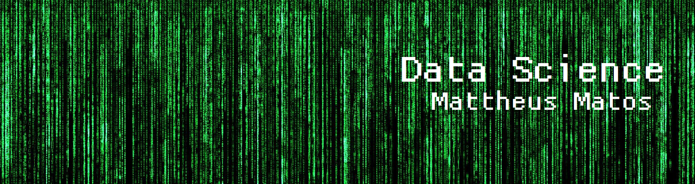

# Data_Science_Projects
My Data Science Projects portfolio.

   

  

# Mattheus Matos
*Python, Data Science, Data Analysis, A.I., Machine Learning, Deep Learning.*

I focus every day on building a knowledge about Technology, Data and A.I.

I am currently a student of Systems Analysis and Development, and also an enthusiast and scholar of Python, Pandas, Matplotlib, Sci-kit Learn, Keras, TensorFlow, PyTorch and everything involved with Data Analysis, Data Science, Machine Learning, Neural Networks and Deep Learning.

I was always in love with technology, but I didn't always dedicate myself to this area. I graduated in Physical Education from State University of Feira de Santana, I worked as a teacher for many years, I was happy for all these years, teaching in public and private schools, lectures, basketball classes and many other things.

However, with all this advent and technological advancement and everything that came with it (data science, IoT, AI, etc.), I decided to follow this path that also makes me very happy and satisfied. 

**Background in:** Python, Machine Learning and Deep Learning.

**Links:**
* [LinkedIn](https://www.linkedin.com/in/matosmattheus/)
* [Medium](https://www.medium.com)

## Projects:

---

